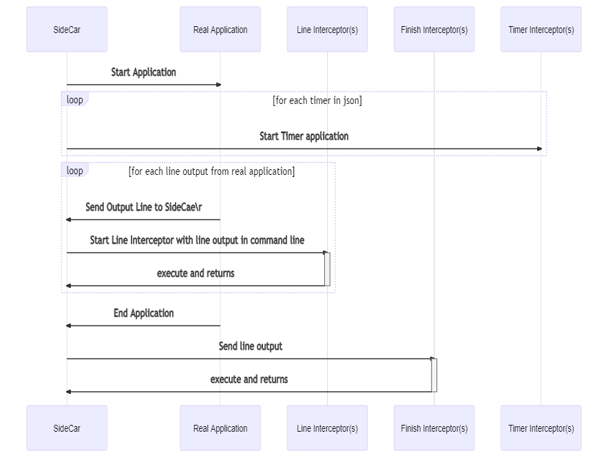

# SideCarCLI

## Releases

You can download as a .NET Tool https://www.nuget.org/packages/sidecarcli/

or

You can download the latest release from the latest CI build, 

https://github.com/ignatandrei/SideCarCLI/actions

## Documentation
 
Diagram for how SideCarCLI works: ( not show regex parsing for the command line)

( mermaid code : 

>sequenceDiagram
  participant S as SideCar
  participant R as Real Application
  participant L as Line Interceptor(s)
  participant F as Finish Interceptor(s)
  participant T as Timer Interceptor(s)
  S->>R: Start Application
  loop for each timer in json
	S->>T: Start Timer application
  end
  loop for each line output from real application
    R->>S: Send Output  Line to SideCae\r
    S->>+L: Start Line Interceptor with line output in command line
    L->>-S: execute and returns
  end
  R->>S: End Application   
  S->>+F: Send line output
  F->>-S: execute and returns

)